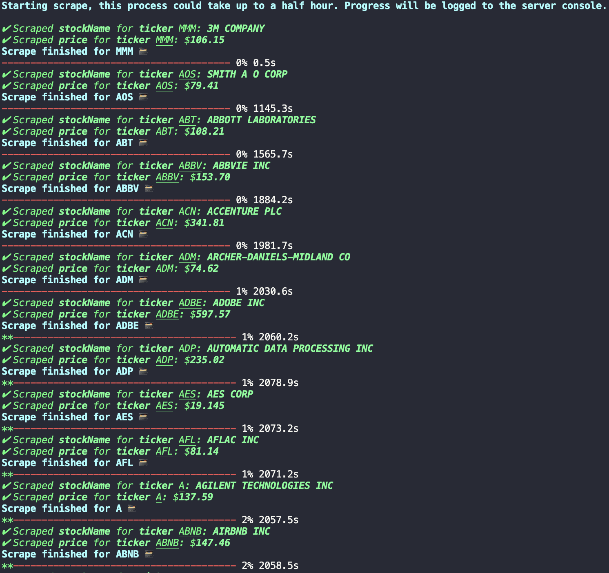
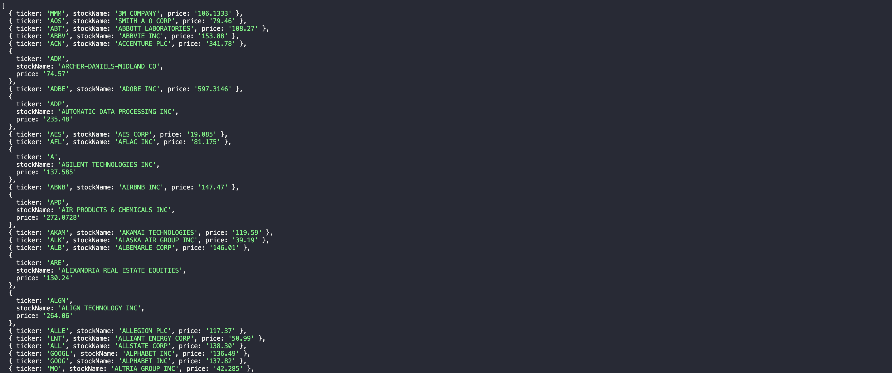
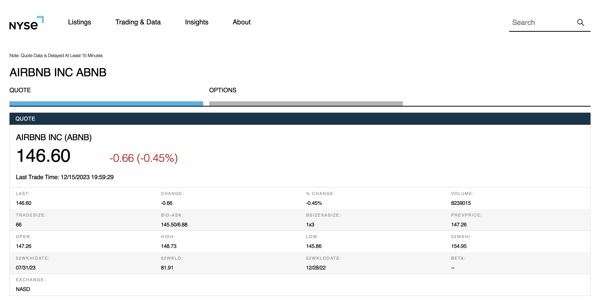
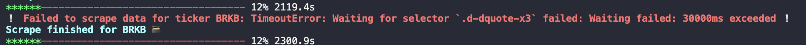
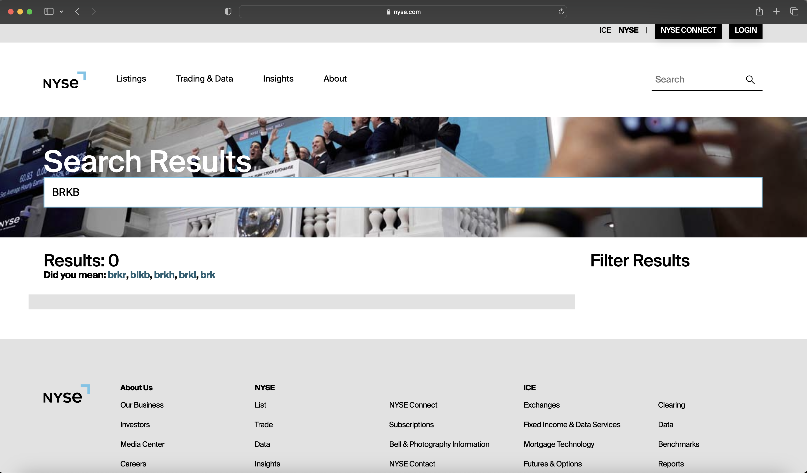
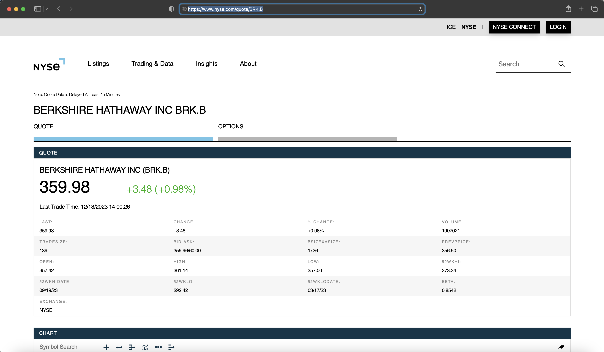

# 🕷️🕸️ shiny-spider 💵🪙

### TABLE OF CONTENTS

- [🧑‍💻 User Story](#user-story)
- [📄 Description](#description)
- [📁 Installation](#installation)
- [🏗️ Usage](#usage)
- [🛠️ Configuration | Customization](#configuration)
- [📜 License](#license)
- [🤝 Contributing](#contributing)
- [📍 Tests](#tests)
- [📲 Contact](#contact)

## USER STORY

 **As a beginner developer looking into using npm packages in my development process to accomplish a variety of tasks:**

  - I want a user-friendly package that scrapes the prices of S&P 500 index listed stocks using puppeteer.

  - I desire an easy-to-use solution that requires minimal configuration and has clear instructions for customization if desired.

  - I would like ethical rate limiting and data caching that will last as long as the server remains running built-in by default, with the rate limit being customizable based on my specific need.

  - I aim for a package that allows for easy customization and refactoring for my specific project needs, spelled out in the documentation and installed modules file comments.

  - I'm looking for a nearly plug-and-play package to ease my introduction to the npm platform, whether as a self-taught programmer or someone starting formal education.

## DESCRIPTION

`shiny-spider` is a user-friendly npm package designed for beginner developers seeking a hassle-free solution to scrape real-time prices of S&P 500 index-listed stocks using puppeteer, directly from the NYSE's quotes. Prioritizing simplicity, this package requires minimal configuration while providing clear instructions for customization. The results of the scrape ran by the main function installing users will utilize (outlined in [🏗️ Usage](#usage)) are returned as an array of Javascript objects. This is [my](https://github.com/wyattbarger) first npm package release, please see the [contact ↓](#contact) section if you would like to discuss any matters regarding this release with me.

## INSTALLATION

`npm install shiny-spider`

Navigate to the root directory of your project, then run the above line of code in a new terminal.

<small>_Note: [📄🔗 Before installing this package, you need to run npm init within your project's directory](https://docs.npmjs.com/cli/v6/commands/npm-init?v=true), so that there is a package.json to install shiny-spider to as a dependency. The line of code below can be used if you have not yet done this._</small>

<small>`npm init -y`</small>

## USAGE

After following the instructions above in "Installation" import the shiny-spider module by pasting the following code at the top of you server.js or index.js file (may vary depending on your naming preferences):

`const shinySpider = require('shiny-spider');`

Using the scraper is as simple as assigning `shinySpider()` to a variable for you to use in your node.js application, as seen bellow:

`const runShinySpider = shinySpider();`

The variable name that you decide to assign shinySpider to can be changed according to your preferences or project needs. Once assigned, shinySpider can be used as a route end point, as a function to seed specific data related to the scrape, and anything else you as the user can apply it to. shinySpider() returns its data in a array of JavaScript objects in the key-value pair format of:

    {
        ticker: '',

        stockName: 'data-from-scrape',

        price 'data-from-scrape',
    }
    

By default this array will contain the five hundred stocks included in the Standard and Poor's 500 Index, with the data being scraped from quotes via the [NYSE 🏦](https://www.nyse.com/quotes).

## CONFIGURATION

The files within the util folder of the shiny-spider module are commented out in a way that should hopefully allow for easy configuration of the main `shinySpider()` function.

*  You should not need to make changes to index.js at the root of the module for simple changes like rate limit, tickers to scrape, data return format, etc.*

* If you would like to customize the tickers that are scraped by `shinySpider()` you can simply add or remove tickers in the format: `"EXMPL",` to the array named tickerArray in the tickerArray.js file in the utils directory of the module.
    * To test any potential tickers you would like to add, plug it into the following url `https://www.nyse.com/quote/'test-ticker-here'`, and so long as a page resembling below loads upon entering the url, shinySpider() should work out of the box for scraping the data (more changes may need to be made if you are also changing the data you want returned from the shinySpider() function). 

    

* If you would like to change the rate that the scrape is able to be ran without your node server being restarted, you can edit the `rateLimit` variable found in spiderLogic.js file in the utils directory of the module.
    * If you customize this variable, please be ethical regarding your server requests, and be mindful of the volume and rate of requests you are sending to the server.

* If you would like to add other fields to be scraped, or change the data that is returned, this should be done within the `async function scrapeData(ticker, page)` found in spiderLogic.js file in the utils directory of the module.
    * Changing adding new scrape parameters should be fairly easy to do by referencing the comments withing the function, and finding the location of the class selectors containing the data you want to scrape by using the Developer Tools in Google Chrome, or your browser of choice.

*For any questions you may have regarding customization, you can reach out to me in the [contact](#contact) section at the bottom of this README file.*

## LICENSE

This project is licensed under the **GNU General Public License v3.0** - see the [LICENSE](LICENSE) file for details.

## CONTRIBUTING

All potential pull requests are welcome, simply follow the contributing guide provided by Github [here.](https://docs.github.com/en/get-started/exploring-projects-on-github/contributing-to-a-project) Contributions should be made with the same original spirit of the project, keeping an easy to install, use, and customize node.js webscraper accessible to new developers.

If you would like to use any of the code for your own project, simply refer to the above license section and follow the outlined procedures, as this code is open source.

I apologize if my contribution guidelines are not entirely clear; this is the first project I've released in this manner. Please feel free to reach out directly to me with questions via the [contact](#contact) section at the bottom of the README file.

## TESTS
The below immediately invoked function was used during the development process to run shinySpider in a console log using await for testing purposes.

    (async () => {
    console.log(await shinySpider());
    })();

You may notice when using the shiny-spider package that occasionally there will be certain stocks that fail to scrape, often at notable point in the trading day or extended market hours (this could be more likely to occur in companies with higher market caps, as more users may be looking for quotes on those tickers).

* In the above screen shot you will see an example of a failed scrape for the ticker BRKB, representing the B class shares of Berkshire Hathaway. When a ticker is unable to have the data scraped for it within 30 seconds the scrape for all data with that ticker is abandoned and an error is returned. This scrape will appear as a null item in the object returned at the end of the `shinySpider()` function.

If you have issues that happen constistently for one stock that does not seem to be related to a traffic or server related issue, then you should first try testing the ticker from the ticker array within the example url we scrape with, found in the[🛠️ Configuration | Customization](#configuration) section of the README.

* This should not happen with the included tickerArray, but if you have customized the array it is more likely you may encounter this issue. For example BRKB needed to be added to the array as `"BRK.B"` upon testing the query with the url from the configuration section, which I was able to finally confirm when adding BRK.B to the url took me directly to the quote without presenting a search result screen.
    
    Example of a url search indicating the ticker is incorrect in `tickerArray.js`.
    
    Example of a url search indicating `shinySpider()` will accept this ticker from tickerArray to run a scrape on.
    

*Google Chrome was the default browser used during the testing and development of this package.*

## CONTACT

🕘 Timezone: CST (UTC-6:00)

Developers GitHub profile:
[wyattbarger](https://github.com/wyattbarger)

Reach the developer on LinkedIn: [wyatt-barger](https://www.linkedin.com/in/wyatt-barger/)

Create a GitHub issue related to this project: [Issues](https://github.com/wyattbarger/shiny-spider/issues)

---
